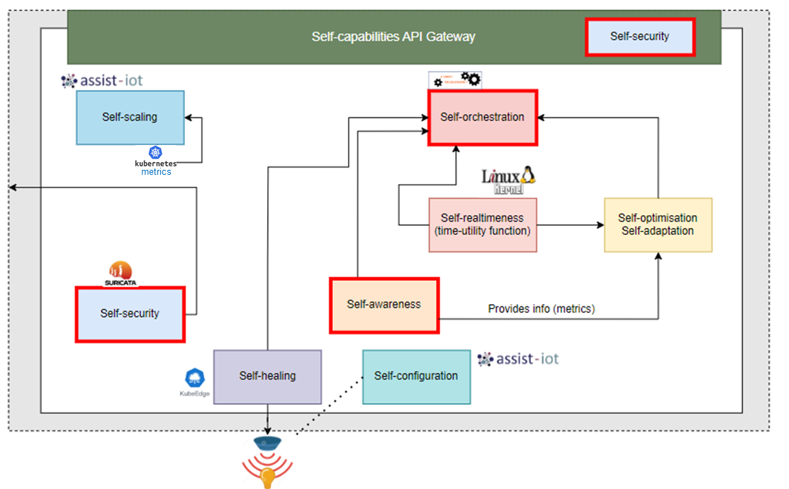

# Self-Security

Self security module will check network interfaces and will analyse traffic to check if there are attacks or vulnerabilities. Potentially a example for simple use case will block the traffic if some rules/conditions are met.

This module focuses on deploying an Intrusion Detection System (IDS) based on suricata on a kubernetes cluster. It aims to monitor network traffic towards the nodes of the kubernetes cluster as described above.

The following figure describe the self-security module inside the IE and the relationship with another self-* modules.

<figure>
  
  <figcaption><b>Figure 1. aerOS sefl-features interaction diagram </b></figcaption>
</figure>

## Getting start / Use

The primary objective is to monitor the network traffic directed towards the nodes of our Kubernetes cluster. The configuration files essential for this module are:

- [suricata-suricata.yaml](suricata-suricata.yaml)
- [suricata-rules.yaml](suricata-rules.yaml)
- [suricata-daemonset.yaml](suricata-daemonset.yaml)
- [suricata.yaml](suricata.yaml)
- [suricata.rules](suricata.rules)


## How to build, install, or deploy it

Before deploying our file `suricata-daemonset.yaml`, we will have to configure the URL of the endpoint server in the:

```yaml
            - name: ENDPOINT_URL
              value: "http://ENDPOINT_URL"
```

>NOTE: the **ETL** configuration to send the Suricata data via the PUT method is located in the [etl](etl) folder

### Setting up

**Setting up the configuration**

We can modify the [suricata.yaml](suricata.yaml)/[suricata-suricata.yaml](suricata-suricata.yaml) and [suricata.rules](suricata.rules)/[suricata-rules.yaml](suricata-rules.yaml) configuration files as required depending on the *Option* we use to apply the configuration, as seen below.

**Applying settings**

There are two options to apply the configuration to the Kubernetes cluster:

- [ ] Option 1:
    ```shell
    kubectl create -f suricata-suricata.yaml
    kubectl create -f suricata-rules.yaml
    kubectl create -f suricata-daemonset.yaml
    ```
- [ ] Option 2:
    ```shell
    kubectl create configmap suricata-config --from-file=suricata.yaml=suricata.yaml
    kubectl create configmap suricata-rules --from-file=suricata.rules
    kubectl create -f suricata-daemonset.yaml
    ```


## Testing

### Basic Test

After deploying Suricata, you can test its functionality by sending ICMP packets using the Ping command. The rules configured in suricata.rules or suricata-rules.yaml will determine Suricata's response.

Use the following commands to test:

```shell
ping <NODE-IP>
```

To verify Suricata's activity:

```shell
kubectl exec -it <POD_NAME> -- cat /var/log/suricata/fast.log
```

```shell
kubectl exec -it <POD_NAME> -- cat /var/log/suricata/eve.json
```

And we will also have to check the data on our endpoint.

### Nmap Test

We can simulate scanning by Nmap to verify that the alerts are generated and are being reflected on the API server. Here we can see some scanning examples that we can check:

- **Nmap SYN Scan**:
	```shell
	nmap -sS -p 80 <target_IP>
	```

- **Nmap FIN Scan**:
	```shell
	nmap -sF -p 80 <target_IP>
	```

- **Nmap NULL Scan**:
	```shell
	nmap -sN -p 80 <target_IP>
	```

## Tutorial

1. Clone the repository.
2. Change the values we want in `suricata.yaml`/`suricata-suricata.yaml` and `suricata.rules`/`suricata-rules.yaml`.
3. Change the value for `http://ENDPOINT_URL` in `suricata-daemonset.yaml`.
4. Deploy the suricata configuration and check firewall rules if we are using cloud services.
5. Perform the test using ICMP traffic.
6. Check Suricata activity.
7. Check the data on our endpoint.

## Credits

This template has been created by: Ramiro Torres (@rtorres_S21Sec) and Jon Egaña (@jegana) as part of the S21Sec team.

This module is based on the project [jasonish/suricata](https://github.com/jasonish/docker-suricata).

## License

The module is distributed under the specified license. For detailed licensing information, refer to the [LICENCE.TXT](LICENCE.TXT) file in the repository.


